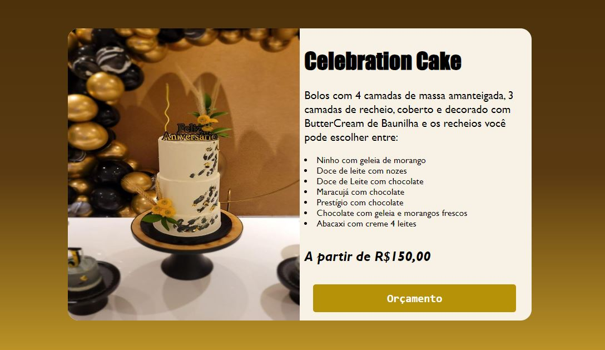

# Primeiro projeto Imersão Vire Dev com Pedro Marins.

##### Este projeto é a criação de um folheto online para solicitação de orçamentos com descrição de produtos. Segue abaixo layout da aplicação:

---

---

## Contato

## Linguagens

